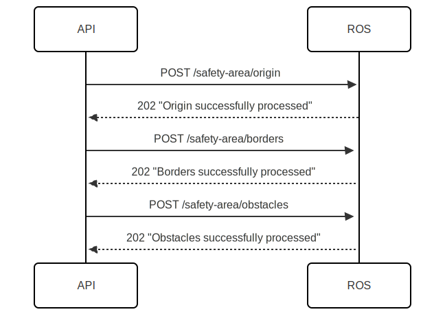
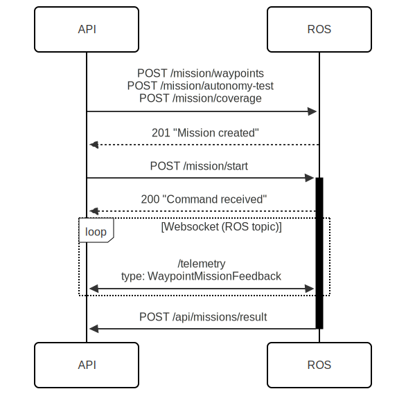

# Signaling Protocol Specification

This document outlines the signaling protocol IROC Bridge package uses to communicate with clients.
Designed to communicate between the web client and ROS.

## HTTP API

You can use the HTTP API to send requests to interact with the robots and receive status information.
The requests and responses are in JSON format.

---

### Robot control

Endpoints for controlling the robots.

- <strong style="color: #61affe">`GET`</strong>
  **/robots**  
  <span style="color: gray">
  List available robots.
  </span>

  <details> 
  <summary>
  <em>Body</em> <span style="color: gray">raw (json)</span>
  </summary>
   
  ```json
    [
      {
        "name": "uav1",
        "type": 0
      },
      {
        "name": "uav2",
        "type": 0

      }

  ]
  ```
  </details>


- <strong style="color: #48cc90">`POST`</strong>
  **/robots/{_robot_name_}/takeoff**  
  <span style="color: gray">
  Command takeoff (single)
  </span>
- <strong style="color: #49CC90">`POST`</strong>
  **/robots/takeoff**  
  <span style="color: gray">
  Takeoff all robots
  </span>
- <strong style="color: #49cc90">`POST`</strong>
  **/robots/{_robot_name_}/hover**  
  <span style="color: gray">
  Command hover (single)
  </span>
- <strong style="color: #49cc90">`POST`</strong>
  **/robots/hover**  
  <span style="color: gray">
  Hover all robots
  </span>
- <strong style="color: #49cc90">`POST`</strong>
  **/robots/{_robot_name_}/land**  
  <span style="color: gray">
  Command land (single)
  </span>
- <strong style="color: #49cc90">`POST`</strong>
  **/robots/land**  
  <span style="color: gray">
  Land all robots
  </span>
- <strong style="color: #49cc90">`POST`</strong>
  **/robots/{_robot_name_}/home**  
  <span style="color: gray">
  Command land home (single)
  </span>
- <strong style="color: #49cc90">`POST`</strong>
  **/robots/home**  
  <span style="color: gray">
  Land home all robots
  </span>

---

### Environment setup

Endpoints for controlling the robot's environment.

> **NOTE** \
> Each step in this sequence depends on the successful completion of the previous step. Please ensure that you first initialize the origin, then the borders, and finally the obstacles, in that exact order.

<figure align="center">
  <picture>
    <source media="(prefers-color-scheme: dark)" srcset="img/environment_sequence_dark.svg" />
    <source media="(prefers-color-scheme: light)" srcset="img/environment_sequence_bright.svg" />
     
  </picture>
  <figcaption>Environment setup sequence diagram</figcaption>
</figure>

- <strong style="color: #49cc90">`POST`</strong>
  **/safety-area/world-origin**  
  <span style="color: gray">
  Set the world origin.
  </span>
  <details> 
  <summary>
  <em>Body</em> <span style="color: gray">raw (json)</span>
  </summary>
   
  We currently only support `frame_id` in LATLON (`id`: 0) 
   
  ```json
  {
  "frame_id": 0, 
  "x": 47.397978,
  "y": 8.545299 
  }
  ```

  </details>

- <strong style="color: #61affe">`GET`</strong>
  **/safety-area/world-origin**  
  <span style="color: gray">
  Retrieve the world origin.
  </span>

  <details>
  <summary>
  <em>Body</em> <span style="color: gray">raw (json)</span>
  </summary>

  Status code: **202 Accepted**

  ```json
  {
    "frame_id": 0,
    "x": 47.397978,
    "y": 8.545299
  }
  ```

  </details>

- <strong style="color: #49cc90">`POST`</strong>
  **/safety-area/borders**  
  <span style="color: gray">
  Set the safety area borders.
  </span>
  <details> 
  <summary>
  <em>Body</em> <span style="color: gray">raw (json)</span>
  </summary>

  ```json
  {
    "points": [
      {
        "x": 47.39776,
        "y": 8.545254
      },
      {
        "x": 47.397719,
        "y": 8.545436
      },
      {
        "x": 47.397601,
        "y": 8.545367
      },
      {
        "x": 47.397657,
        "y": 8.545191
      }
    ],
    "height_id": 1,
    "max_z": 347,
    "min_z": 343
  }
  ```

  </details>

- <strong style="color: #61affe">`GET`</strong>
  **/safety-area/borders**  
  <span style="color: gray">
  Retrieve the safety border.
  </span>

  <details>
  <summary>
  <em>Body</em> <span style="color: gray">raw (json)</span>
  </summary>

  Status code: **202 Accepted**

  ```json
  {
    "frame_id": 1,
    "min_z": 0,
    "points": [
      {
        "x": 47.398283001578619178,
        "y": 8.54231999998631863491
      },
      {
        "y": 8.5464419999864418287,
        "x": 47.3979670015785998771
      },
      {
        "x": 47.3972980015784983721,
        "y": 8.54602099998643183199
      },
      {
        "x": 47.3975810015785512519,
        "y": 8.5447099999863915798
      },
      {
        "y": 8.54231999998631863491,
        "x": 47.398283001578619178
      }
    ],
    "height_id": 0,
    "max_z": 15,
    "message": "All robots in the fleet with the same safety border"
  }
  ```

  </details>

- <strong style="color: #49cc90">`POST`</strong>
  **/safety-area/obstacles**  
  <span style="color: gray">
  Set the safety area obstacles.
  </span>
  <details>
    <summary>
    <em>Body</em> <span style="color: gray">raw (json)</span>
    </summary>

  ```json
  {
    "obstacles": [
      {
        "points": [
          {
            "x": 47.39776,
            "y": 8.545254
          },
          {
            "x": 47.397719,
            "y": 8.545436
          },
          {
            "x": 47.397601,
            "y": 8.545367
          },
          {
            "x": 47.397657,
            "y": 8.545191
          }
        ],
        "height_id": 1,
        "max_z": 347,
        "min_z": 343
      },
      {
        "points": [
          {
            "x": 47.3979,
            "y": 8.5458
          },
          {
            "x": 47.397855,
            "y": 8.54595
          },
          {
            "x": 47.39775,
            "y": 8.54589
          },
          {
            "x": 47.397795,
            "y": 8.54574
          }
        ],
        "height_id": 1,
        "max_z": 350,
        "min_z": 345
      },
      {
        "points": [
          {
            "x": 47.3981,
            "y": 8.5451
          },
          {
            "x": 47.39805,
            "y": 8.54525
          },
          {
            "x": 47.39795,
            "y": 8.5452
          },
          {
            "x": 47.398,
            "y": 8.54505
          }
        ],
        "height_id": 1,
        "max_z": 352,
        "min_z": 348
      }
    ]
  }
  ```

  </details>

- <strong style="color: #61affe">`GET`</strong>
  **/safety-area/obstacles**  
  <span style="color: gray">
  Retrieve the obstacles.
  </span>

  <details>
  <summary>
  <em>Body</em> <span style="color: gray">raw (json)</span>
  </summary>

  Status code: **202 Accepted**

  ```json
  {
    "obstacles": [
      {
        "height_id": 0,
        "max_z": 7.05999999660582489014,
        "frame_id": 1,
        "min_z": 3.05999999660582489014,
        "points": [
          {
            "x": 47.3977600015785611731,
            "y": 8.54525399998640722288
          },
          {
            "y": 8.54543599998641312254,
            "x": 47.3977190015785652122
          },
          {
            "x": 47.3976010015785576002,
            "y": 8.54536699998641147147
          },
          {
            "x": 47.3976570015785512169,
            "y": 8.54519099998640641047
          },
          {
            "y": 8.54525399998640722288,
            "x": 47.3977600015785611731
          }
        ]
      },
      {
        "points": [
          {
            "y": 8.54579999998642314551,
            "x": 47.3979000015785771893
          },
          {
            "x": 47.3978550015785771166,
            "y": 8.54594999998642634864
          },
          {
            "y": 8.54588999998642506739,
            "x": 47.3977500015785722098
          },
          {
            "y": 8.54573999998642364062,
            "x": 47.3977950015785864935
          },
          {
            "x": 47.3979000015785771893,
            "y": 8.54579999998642314551
          }
        ],
        "min_z": 5.05999999660582489014,
        "frame_id": 1,
        "max_z": 10.0599999966058248901,
        "height_id": 0
      },
      {
        "height_id": 0,
        "max_z": 12.0599999966058248901,
        "frame_id": 1,
        "min_z": 6.44836723768419848974e-31,
        "points": [
          {
            "x": 47.3981000015786122503,
            "y": 8.54509999998640168428
          },
          {
            "y": 8.54524999998640488741,
            "x": 47.3980500015786105905
          },
          {
            "x": 47.39795000157859306,
            "y": 8.54519999998640500394
          },
          {
            "x": 47.3980000015786018253,
            "y": 8.54504999998640002445
          },
          {
            "y": 8.54509999998640168428,
            "x": 47.3981000015786122503
          }
        ]
      }
    ],
    "message": "All robots in the fleet with the same obstacles"
  }
  ```

  </details>

> **NOTE** \
> In case of any discrepancy within the robot's safety border, obstacles & origin, having different values
> You will receive a Status code **409 Conflict**, and a message to let the user know about the conflict:

```json
{
  "message": "Call was not successful with message: Discrepancy in the borders between the fleet, please set the safety borders!"
}
```

---

## Missions

The missions are handled by `IROC Fleet Manager`: a node responsible for sending the mission to the robots, monitoring their progress, and sending the aggregated information to the `IROC Bridge`.

- <strong style="color: #49cc90">`POST`</strong>
  **/mission**  
  <span style="color: gray">
  Set a mission
  </span>

<figure align="center">
  <picture>
    <source media="(prefers-color-scheme: dark)" srcset="img/mission_diagram_dark.svg" />
    <source media="(prefers-color-scheme: light)" srcset="img/mission_diagram.svg" />
     
  </picture>
  <figcaption>Mission Sequence Diagram</figcaption>
</figure>

The mission request requires the following fields:

- **type key** to specify the mission type and the specific details of the mission.
- **details key** with the specific details for each mission.
- **Uuid key** for synchronization with the UI.

  <details>
  <summary>
  <em> WaypointPlanner: Body</em> <span style="color: gray">raw (json)</span>
  </summary>

  ```json
  {
      "type": "WaypointPlanner",
      "uuid": "550e8400-e29b-41d4-a716-446655440000",
      "details": {
        "robots": [
          {
            "name": "uav1",
            "frame_id": 0,
            "height_id": 0,
            "points": [
              {
                "x": 20,
                "y": 10,
                "z": 3,
                "heading": 1
              },
              {
                "x": 20,
                "y": 10,
                "z": 3,
                "heading": 3
              },
              {
                "x": -20,
                "y": -20,
                "z": 4,
                "heading": 3,
                "subtasks": [
                  {
                    "type": "gazebo_gimbal",
                    "parameters": [0.5, 0.5, 0.5]
                  }
                ]
              },
              {
                "x": -10,
                "y": 10,
                "z": 5,
                "heading": 3
              },
              {
                "x": 10,
                "y": -10,
                "z": 4,
                "heading": 3,
                "subtasks": [
                  {
                    "type": "wait",
                    "parameters": 5.6
                  }
                ]
              },
              {
                "x": 20,
                "y": 10,
                "z": 3,
                "heading": 1
              }
            ],
            "terminal_action": 0
          }
        ]
      }
  }
  ```

  </details>

  <details>
  <summary>
  <em> Coverage Planner: Body</em> <span style="color: gray">raw (json)</span>
  </summary>

  ```json
  {
    "type": "CoveragePlanner",
    "uuid": "b5aaa323-64e5-4eb8-8615-e4059fe84997",
    "details": {
      "robots": ["uav1", "uav2"],
      "search_area": [
        {
          "x": 47.397978,
          "y": 8.545299
        },
        {
          "x": 47.397848,
          "y": 8.545872
        },
        {
          "x": 47.397551,
          "y": 8.54572
        },
        {
          "x": 47.397699,
          "y": 8.545129
        }
      ],
      "height_id": 0,
      "height": 5,
      "terminal_action": 0
    }
  }
  ```

  </details>
  
  <details>
  <summary>
  <em> AutonomyTestPlanner: Body</em> <span style="color: gray">raw (json)</span>
  </summary>

  ```json
  {
    "type": "AutonomyTestPlanner",
    "uuid": "20ab7a6c-231b-48ed-83cc-864041ae40bd",
    "details": {
      "robots": [
        {
          "name": "uav1",
          "segment_length": 5
        }
      ]
    }
  }
  ```

  </details>
  
---

### Mission Response Examples

The result follows the following structure:

- **message**: General message about the status of the mission.
- **success**: Boolean to denote if the mission was uploaded successfully.
- **type**: Type of the mission.
- **uuid**: The UUID of the mission.
- **robot_data**: An array with details for each robot in the mission.
  - **robot**: String with the name of the robot.
  - **message**: Individual robot message.
  - **success**: Boolean to denote the individual result of the robot.
  - **mission**: The details of the mission that were loaded into the robot.

1. Successful mission upload

  <details>
   <summary>
   <em>Body</em> <span style="color: gray"> example response (json)</span>
   </summary>
  Code: 201 Created
  
   ```json
   {
    "robot_data":[
       {
          "message": "Mission loaded successfully",
          "mission":{
             "frame_id":0,
             "height_id":0,
             "points":[
                {
                   "x":20,
                   "y":10,
                   "heading":1,
                   "z":3
                },
                {
                   "z":3,
                   "heading":3,
                   "y":10,
                   "x":20
                },
                {
                   "x":-20,
                   "y":-20,
                   "heading":3,
                   "z":4
                },
                {
                   "x":-10,
                   "y":10,
                   "heading":3,
                   "z":5
                },
                {
                   "z":4,
                   "heading":3,
                   "y":-10,
                   "x":10
                },
                {
                   "z":3,
                   "heading":1,
                   "y":10,
                   "x":20
                }
             ]
          },
          "success": true,
          "robot" :"uav1"
       }
    ],
    "uuid":"550e8400-e29b-41d4-a716-446655440000",
    "type": "WaypointPlanner",
    "message": "Mission uploaded successfully",
    "success" :true
   }
   ```
  
  </details>

2. Uploading mission failure due to safety validation.
<details>

  <summary>
  <em>Body</em> <span style="color: gray"> example response (json)</span>
  </summary>
- Code: 400 Bad Request

- Example value:

```json
{
  "robot_data": [
    {
      "message": "The given points are valid for: uav1, however the generated trajectory seems to be outside of safety area or within an obstacle.",
      "mission": [],
      "success": false,
      "robot": "uav1"
    }
  ],
  "message": "Failure starting robot clients.",
  "success": false
}
```

```json
{
  "robot_data": [
    {
      "message": "Unvalid trajectory for uav1, trajectory is outside of safety area",
      "mission": [],
      "success": false,
      "robot": "uav1"
    }
  ],
  "message": "Failure starting robot clients.",
  "success": false
}
```

</details>

3. Uploading mission failure due to loaded mission in server.
<details>

  <summary>
  <em>Body</em> <span style="color: gray"> example response (json)</span>
  </summary>
- Code: 409 Conflict

- Example value:

```json
{
  "message": "Mission is already running. Terminate the previous one, or wait until it is finished."
}
```

</details>

---

### Mission `GET` endpoint

- <strong style="color: #61affe">`GET`</strong>
  **/mission**  
  <span style="color: gray">
  Retrieve the mission loaded in the server.
  </span>

  <details>
  <summary>
  <em>Body</em> <span style="color: gray">raw (json)</span>
  </summary>

  Status code: **202 Accepted**

  ```json
  {
    "robot_data": [
      {
        "message": "Mission loaded successfully",
        "mission": {
          "frame_id": 0,
          "height_id": 0,
          "points": [
            {
              "x": 20,
              "y": 10,
              "heading": 1,
              "z": 3
            },
            {
              "z": 3,
              "heading": 3,
              "y": 10,
              "x": 20
            },
            {
              "x": -20,
              "y": -20,
              "heading": 3,
              "z": 4
            },
            {
              "x": -10,
              "y": 10,
              "heading": 3,
              "z": 5
            },
            {
              "z": 4,
              "heading": 3,
              "y": -10,
              "x": 10
            },
            {
              "z": 3,
              "heading": 1,
              "y": 10,
              "x": 20
            }
          ]
        },
        "success": true,
        "robot": "uav1"
      }
    ],
    "uuid": "550e8400-e29b-41d4-a716-446655440000",
    "type": "WaypointPlanner",
    "message": "Mission uploaded successfully",
    "success": true
  }
  ```

  </details>

If there is no active mission, you will get an unsuccessful response, with the message that there is no active mission:

  <details>
  <summary>
  <em>Body</em> <span style="color: gray">raw (json)</span>
  </summary>


  ```json
  {
      "robot_data": [],
      "success": false,
      "message": "No active mission."
  }
  ```

  </details>

---

### Mission Control Endpoints

We support both fleet-wide and individual robot mission control.

**Fleet Mission Control**:

These endpoints control the mission status for all assigned robots at once: \

- <strong style="color: #49cc90">`POST`</strong>
  **/mission/start**  
  <span style="color: gray">
  Start the mission for all robots.
  </span>
- <strong style="color: #49cc90">`POST`</strong>
  **/mission/pause**  
  <span style="color: gray">
  Pause the mission for all robots.
  </span>
- <strong style="color: #49cc90">`POST`</strong>
  **/mission/stop**  
  <span style="color: gray">
  Stop the mission for all robots.
  </span>

**Robot Mission Control**:

You can also control individual mission robots using these endpoints:

- <strong style="color: #49cc90">`POST`</strong>
  **/robots/{_robot_name_}/mission/start**  
   <span style="color: gray">
  Start the mission for a specific robot.
  </span>

  > **NOTE** \
  > Starting a mission for a single robot will activate that robot while the others remain waiting. You can later use the `/mission/start` endpoint to activate the remaining robots and continue the mission.

- <strong style="color: #49cc90">`POST`</strong>
  **/robots/{_robot_name_}/mission/pause**  
  <span style="color: gray">
  Pause the mission for a specific robot.
  </span>
- <strong style="color: #49cc90">`POST`</strong>
  **/robots/{_robot_name_}/mission/stop**  
   <span style="color: gray">
  Stop the mission for a specific robot.
  </span>
  > **NOTE** \
  > Stopping the mission for a single robot will also abort the overall mission and stop all other robots. This behavior is intentional, as the mission assumes the participation of all assigned robots.

---

### Feedback

During an active mission, the feedback message is broadcast to the connected clients through a WebSocket in the `/telemetry` path.

- <strong style="color: orange">`onmessage`</strong>
  **Waypoint Mission and Autonomy Test Feedback.**
  <details>
  <summary>
  <em>Message</em> <span style="color: gray">raw (json)</span>
  </summary>

  ```json
  {
    "type": "WaypointMissionFeedback",
    "progress": 0.75,
    "mission_state": "IN_PROGRESS",
    "message": "EXECUTING",
    "robots": [
      {
        "robot_name": "uav1",
        "message": "EXECUTING",
        "mission_progress": 0.6,
        "current_goal": 2,
        "distance_to_goal": 15.3,
        "goal_estimated_arrival_time": 30,
        "goal_progress": 0.8,
        "distance_to_finish": 50.2,
        "finish_estimated_arrival_time": 50
      },
      {
        "robot_name": "uav2",
        "message": "EXECUTING",
        "mission_progress": 0.45,
        "current_goal": 1,
        "distance_to_goal": 5.7,
        "goal_estimated_arrival_time": 30,
        "goal_progress": 0.95,
        "distance_to_finish": 75.8,
        "finish_estimated_arrival_time": 50
      }
    ]
  }
  ```

  </details>

> **NOTE** \
> Autonomy test follows the same structure as the waypoint mission feedback, but it will always contain only one robot.

---

### Result

When a mission is finished, the result message will be sent to

<strong style="color: #49cc90">`POST`</strong>
**http://server:8000/api/missions/result**  
<span style="color: gray">
Send the result of the mission.
</span>

<details>
  <summary>
  <em>Body</em> <span style="color: gray">raw (json)</span>
  </summary>

```json
{
  "success": true,
  "message": "All robots finished successfully",
  "robot_results": [
    {
      "robot_name": "uav1",
      "success": true,
      "message": "Robot finished successfully"
    },
    {
      "robot_name": "uav2",
      "success": true,
      "message": "Robot finished successfully"
    }
  ]
}
```

</details>

---

## Subtasks

On the Waypoint missions, you can send a list of subtasks that will be executed by the robot when it reaches a waypoint. You just need to add a new field called `subtasks` in the waypoint message, which is an array of subtasks. Requests are retro-compatible, so you can use the feature without changing the existing missions or additional fields.

There are two types of subtasks supported: `wait` and `gazebo_gimbal` (for simulation), but they can be extended in the future due to the ROS `plugin` architecture in `iroc_mission_handler`.

---

### `wait` - Temporal Delay

Introduces a pause in mission execution for a specified duration.

#### Parameters

It receives a floating-point number representing the duration in seconds.

#### Usage Example

```json
{
  "type": "wait",
  "parameters": 5.0
}
```

---

### `gazebo_gimbal` - Camera Orientation Control

Controls the gimbal system to orient the camera towards specific angles.

#### Parameters

It receives an array of three floating-point numbers representing the camera orientation angles in radians (`roll`, `pitch`, `yaw`)

#### Usage Example

```json
{
  "type": "gazebo_gimbal",
  "parameters": [1.0, 0.5, 0.0]
}
```

---

### Waypoint Structure

The subtask system allows you to define complex behaviors that are executed when a robot reaches a waypoint.

Each waypoint now supports the following structure:

```json
{
  // Standard `x`, `y` and `z` data
  "subtasks": [
    // Array of subtask objects
  ],
  "parallel_execution": false // Optional: Whether subtasks can be executed in parallel
}
```

#### Parallel Execution

- **Default**: `false` (sequential execution)
- **When `true`**: Subtasks are executed simultaneously
- **When `false`**: Subtasks are executed one after another (sequentially)

---

### Subtask Configuration

Each subtask supports advanced execution control through the following fields:

#### Basic Fields

These are the fundamental fields for configuring a subtask:

- `type`: Type of task to execute
- `parameters`: Task-specific parameters (string format)

#### Advanced Execution Control

- `continue_without_waiting`: If `true`, the mission continues without waiting for this subtask to complete
- `stop_on_failure`: If `true`, the entire mission stops if this task fails
- `max_retries`: Maximum number of retry attempts if the task fails (0 = no retries)
- `retry_delay`: Delay in seconds before retrying a failed task

#### Example Subtask Structure

```json
{
  "type": "wait",
  "parameters": "5.0",
  "continue_without_waiting": false,
  "stop_on_failure": true,
  "max_retries": 3,
  "retry_delay": 2.0
}
```

#### Mission with multiple subtasks example:

<details>
  <summary>
  <em>Body</em> <span style="color: gray">raw (json)</span>
  </summary>

```json
{
  "type": "WaypointPlanner",
  "uuid": "550e8400-e29b-41d4-a716-446655440000",
  "details": {
    "robots": [
      {
        "name": "uav1",
        "frame_id": 0,
        "height_id": 0,
        "points": [
          {
            "x": 20,
            "y": 10,
            "z": 3,
            "heading": 1
          },
          {
            "x": 20,
            "y": 10,
            "z": 3,
            "heading": 3
          },
          {
            "x": -20,
            "y": -20,
            "z": 4,
            "heading": 3,
            "subtasks": [
              {
                "type": "gazebo_gimbal",
                "parameters": [0.5, 0.5, 0.5],
                "continue_without_waiting": false,
                "stop_on_failure": false,
                "max_retries": 1,
                "retry_delay": 0
              },
              {
                "type": "wait",
                "parameters": 5.6
              }
            ],
            "parallel_execution": true
          },
          {
            "x": -10,
            "y": 10,
            "z": 5,
            "heading": 3
          },
          {
            "x": 10,
            "y": -10,
            "z": 4,
            "heading": 3,
            "subtasks": [
              {
                "type": "wait",
                "parameters": 5.6
              }
            ]
          },
          {
            "x": 20,
            "y": 10,
            "z": 3,
            "heading": 1,
            "subtasks": [
              {
                "type": "wait",
                "parameters": 5.6
              }
            ]
          }
        ],
        "terminal_action": 0
      }
    ]
  }
}
```

</details>

---

## WebSocket API

You can use the WebSocket API to receive robots telemetry and send requests to control the robots.

### Telemetry

Robot's data and status can be received periodically in the `/telemetry` path.

- <strong style="color: orange">`onmessage`</strong>
  **General Robot Info**
  <details>
    <summary>
    <em>Message</em> <span style="color: gray">raw (json)</span>
    </summary>

  ```json
  {
    "errors": [],
    "type": "GeneralRobotInfo",
    "ready_to_start": 1,
    "problems_preventing_start": [],
    "battery_state": {
      "wh_drained": -1,
      "percentage": -1,
      "voltage": -1
    },
    "robot_type": 0,
    "robot_name": "uav2"
  }
  ```

  </details>

- <strong style="color: orange">`onmessage`</strong>
  **State Estimation Info**
  <details>
    <summary>
    <em>Message</em> <span style="color: gray">raw (json)</span>
    </summary>
    
    ````json
    {
      "type": "StateEstimationInfo",
      "switchable_estimators": [
        "gps_baro",
        "gps_garmin"
      ],
      "velocity": {
        "angular": {
          "z": 0,
          "y": 0,
          "x": 0
        },
        "linear": {
          "z": 4.6765261112091244e-21,
          "y": 0,
          "x": 0
        }
      },
      "global_pose": {
        "heading": 1.02729905983773,
        "altitude": 340,
        "longitude": 8.545800727209587,
        "latitude": 47.39776586900617
      },
      "local_pose": {
        "z": 0.059999996605801006,
        "heading": 1.02729905983773,
        "y": 2.4504742256806935,
        "x": 15.614331170562465
      },
      "current_estimator": "gps_baro",
      "above_ground_level_height": 0.059999996605801,
      "running_estimators": [
        "gps_baro",
        "gps_garmin"
      ],
      "acceleration": {
        "angular": {
          "z": 0,
          "y": 0,
          "x": 0
        },
        "linear": {
          "z": 1.0095692646347513e-18,
          "y": 0,
          "x": 0
        }
      },
      "estimation_frame": "uav2/gps_garmin_origin",
      "robot_name": "uav2"
    }
    ````
  </details>

- <strong style="color: orange">`onmessage`</strong>
  **Control Info**
  <details>
    <summary>
    <em>Message</em> <span style="color: gray">raw (json)</span>
    </summary>
    
    ````json
    {
      "type": "ControlInfo",
      "thrust": null,
      "available_trackers": [],
      "active_tracker": "unknown",
      "available_controllers": [],
      "active_controller": "unknown",
      "robot_name": "uav2"
    }
    ````
  </details>

- <strong style="color: orange">`onmessage`</strong>
  **Collision Avoidance Info**
  <details>
    <summary>
    <em>Message</em> <span style="color: gray">raw (json)</span>
    </summary>
    
    ````json
    {
      "type": "CollisionAvoidanceInfo",
      "other_robots_visible": [
        "uav1"
      ],
      "collision_avoidance_enabled": 1,
      "avoiding_collision": 0,
      "robot_name": "uav2"
    }
    ````
  </details>

- <strong style="color: orange">`onmessage`</strong>
  **UAV Info**
  <details>
    <summary>
    <em>Message</em> <span style="color: gray">raw (json)</span>
    </summary>

  ```json
  {
    "mass_nominal": null,
    "type": "UavInfo",
    "flight_duration": 0,
    "flight_state": "OFFBOARD",
    "offboard": 1,
    "armed": 1,
    "robot_name": "uav2"
  }
  ```

  </details>

- <strong style="color: orange">`onmessage`</strong>
  **System Health Info**
  <details>
    <summary>
    <em>Message</em> <span style="color: gray">raw (json)</span>
    </summary>

  ```json
  {
    "free_ram": 22.789223,
    "robot_name": "uav2",
    "cpu_load": 10.102389,
    "mag_strength": null,
    "total_ram": 30.061069,
    "type": "SystemHealthInfo",
    "mag_uncertainty": null,
    "free_hdd": 1393,
    "state_estimation_rate": 20.080807,
    "hw_api_rate": 99.019608,
    "control_manager_rate": 0.990196,
    "gnss_uncertainty": 0,
    "node_cpu_loads": [
      ["/uav2/hw_api", 1.09215],
      ["/uav2/constraint_manager", 1.09215],
      ["/uav2/control_manager", 1.09215],
      ["/uav2/estimation_manager", 0]
    ],
    "available_sensors": [
      {
        "name": "pixhawk",
        "status": "NOT_IMPLEMENTED",
        "ready": 1,
        "rate": -1
      },
      {
        "rate": -1,
        "ready": 1,
        "status": "NOT_IMPLEMENTED",
        "name": "garmin_down"
      }
    ]
  }
  ```

  </details>

- <strong style="color: orange">`onmessage`</strong>
  **Sensor Info**
    <details>
      <summary>
      <em>Message</em> <span style="color: gray">raw (json)</span>
      </summary>

  ```json
  {
  "type": "SensorInfo"
  "details": {
    "type": 7,
    "camera_frame_tf": {
      "rotation_rpy": {
        "pitch": -0.000007,
        "roll": -0.038402,
        "yaw": 0
      },
      "translation": {
        "x": 0.09669,
        "y": 0.002004,
        "z": -0.060549
      }
    },
    "camera_info": {
      "fov_x_rad": 1.92,
      "fov_y_rad": 1.353683,
      "height": 1080,
      "width": 1920
    },
    "camera_orientation": {
      "orientation_rpy": {
        "pitch": -0.000007,
        "roll": -0.038402,
        "yaw": 0
      }
    },
    "optical_frame_tf": {
      "rotation_rpy": {
        "pitch": -0.038402,
        "roll": -1.570789,
        "yaw": -1.570796
      },
      "translation": {
        "x": 0.09669,
        "y": 0.002004,
        "z": -0.060549
      }
    }
  },
  "type": "SensorInfo"
  }
  ```

  >NOTE: The `type` field in the `details` object indicates the sensor type (e.g., 7 for camera).
  > The available sensor types are defined in the `mrs_robot_diagnostics/SensorStatus` message.
  > The available types are:
    > - 0: Autopilot
    > - 1: Rangefinder
    > - 2: GPS
    > - 3: IMU
    > - 4: Barometer
    > - 5: Magnetometer
    > - 6: LIDAR
    > - 7: camera

    </details>

### Robot remote control

You can use the WebSocket API to control the robots in the `/rc` path.

- <strong style="color: orange">`onmessage`</strong>
  **Message**  
  <span style="color: gray">
  Similar to a ping websocket message.
  </span>
  <details>
    <summary>
    <em>Message</em> <span style="color: gray">raw (json)</span>
    </summary>

  ```json
  {
    "command": "message",
    "data": "Hello, World!"
  }
  ```

  </details>

- <strong style="color: orange">`onmessage`</strong>
  **Movement**  
  <span style="color: gray">
  To control the UAV, it receives normalized linear (`x`, `y`, `z`) and angular (`yaw`) velocities.
  </span>
  <details>
    <summary>
    <em>Message</em> <span style="color: gray">raw (json)</span>
    </summary>

  ```json
  {
    "command": "move",
    "robot_name": "uav1",
    "data": {
      "x": 1.0,
      "y": -0.5,
      "z": 0,
      "heading": 1.0
    }
  }
  ```

  </details>

---

## Camera stream using WebRTC

The features for the camera streaming are available, and the setup can be tested by starting the simulator with the camera argument for that will start the gazebo simulator:

```sh
./start --camera
```

This will start the WebRTC server and allow the camera stream to be visualized on port `9090` of the server.

> **NOTE** \
> Please follow the instructions for the installation of dependencies in the [webrtc_ros](https://github.com/fly4future/webrtc_ros) repository. A detailed example of how the integration can be done is [here](https://github.com/fly4future/webrtc_ros/blob/develop/web/TUTORIAL.md).
